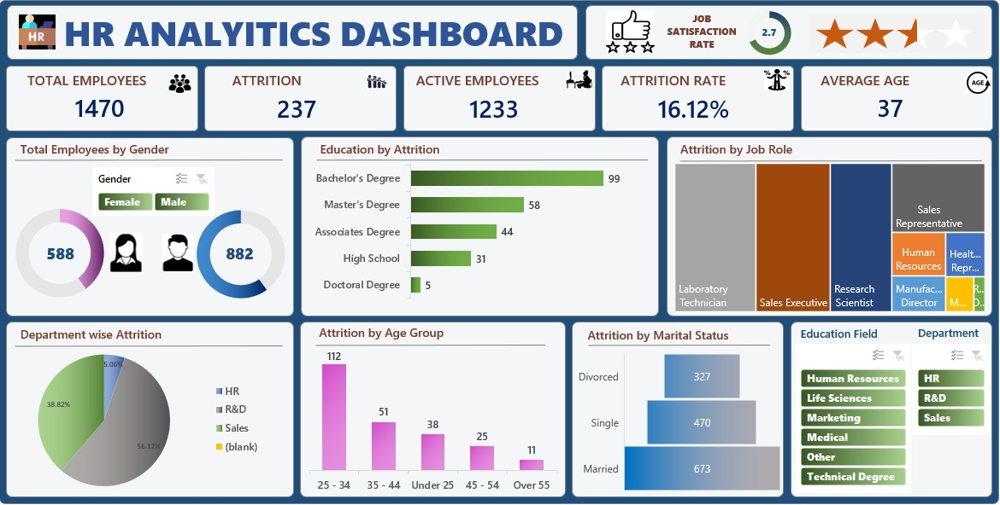
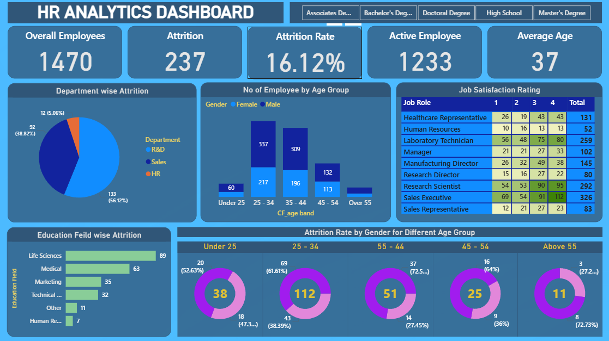
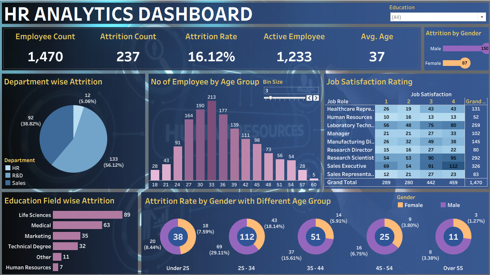

# HR Analytics Project

## Problem Statement

Human Resource departments collect large volumes of employee data, but raw data alone does not provide actionable insights. The objective of this project is to analyze HR data to identify employee attrition patterns, workforce demographics, job satisfaction trends, salary distribution, and departmental performance. The goal is to transform employee data into meaningful business insights that support workforce planning, employee retention, and strategic decision-making.

---

## Dataset Information

The dataset contains employee-related information such as:

* Employee ID
* Age
* Gender
* Department
* Job Role
* Education
* Marital Status
* Monthly Income
* Years at Company
* Job Satisfaction
* Performance Rating
* Attrition Status

The dataset was analyzed using Excel, SQL, Power BI, and Tableau.

---

## Data Cleaning

Data cleaning was performed to improve data quality and ensure accurate analysis.

### Cleaning Steps

* Checked for missing values
* Removed duplicate records
* Corrected inconsistent values
* Verified data types
* Standardized column names
* Validated categorical data
* Handled null and blank values

---

## Exploratory Data Analysis (EDA)

Exploratory analysis was conducted to understand workforce composition and employee behavior.

### Analysis Performed

* Employee Distribution Analysis
* Attrition Analysis
* Gender Distribution
* Department-wise Employee Analysis
* Age Group Analysis
* Salary Distribution
* Job Satisfaction Analysis
* Experience Analysis

---

## SQL Analysis

Business-oriented SQL queries were used to calculate key HR metrics and answer workforce-related questions.

### KPIs Calculated

* Total Employees
* Active Employees
* Attrition Count
* Attrition Rate
* Average Salary
* Average Years at Company

### Business Questions Answered

* Which department has the highest attrition?
* What is the employee distribution by gender?
* Which age groups have the highest attrition?
* How does salary impact employee retention?
* Which departments have the largest workforce?

---

## Power BI Analysis

Power BI was used to create an interactive HR dashboard for workforce monitoring and decision-making.

### Dashboard Features

* KPI Cards

  * Total Employees
  * Active Employees
  * Attrition Count
  * Attrition Rate
  * Average Salary

* Attrition Analysis

* Department-wise Employee Distribution

* Gender Analysis

* Education Analysis

* Job Satisfaction Analysis

* Salary Distribution

* Experience Analysis

* Interactive Filters and Slicers

---

## Tableau Analysis

Tableau dashboards were developed to provide additional visual exploration of HR trends.

### Visualizations Included

* Employee Demographics Dashboard
* Attrition Dashboard
* Department Performance Dashboard
* Salary Analysis Dashboard
* Workforce Distribution Dashboard

---

## Dashboard Preview

# Excel Dashboard

# Power BI Dashboard

# Tableau Dashboard

---

## Key Insights

* Certain departments experienced significantly higher attrition rates.
* Employees with lower job satisfaction showed a higher likelihood of leaving the organization.
* Salary levels influenced employee retention and engagement.

---

## Recommendations

Based on the analysis, the following recommendations are proposed:

1. Develop targeted retention strategies for high-attrition departments.
2. Improve employee engagement and job satisfaction programs.
3. Provide career development and training opportunities.

---

## Tools & Technologies

* Excel
* SQL
* Power BI
* Tableau
* Data Visualization
* Business Intelligence

---

## Author

**Pranjal Nerkar**
